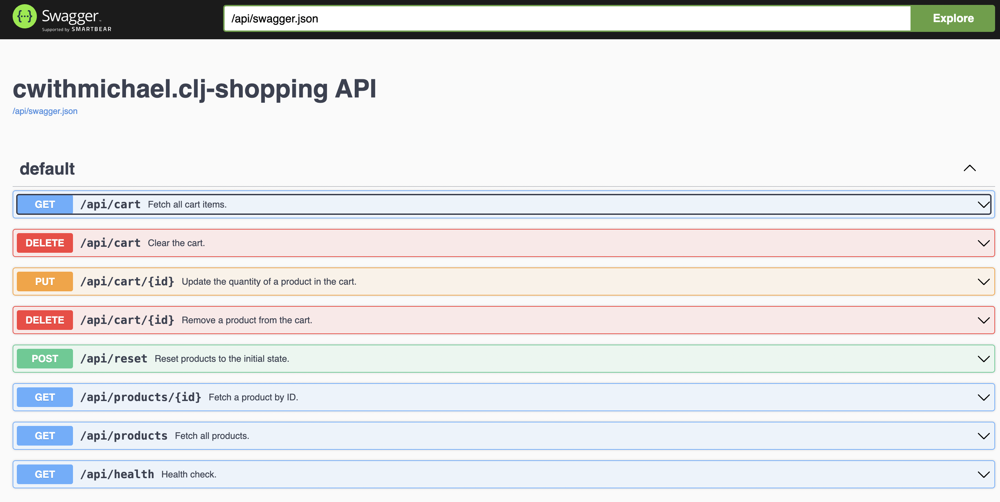
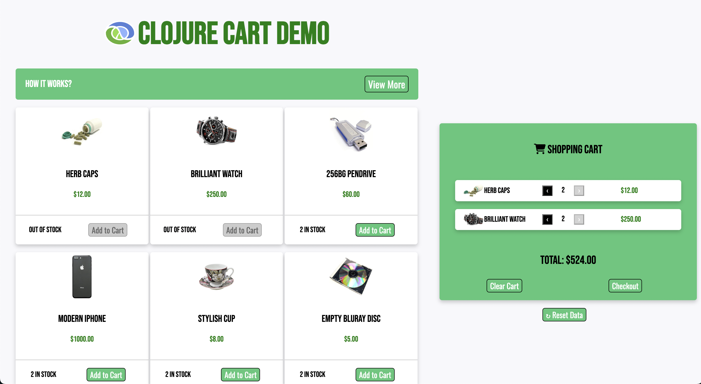
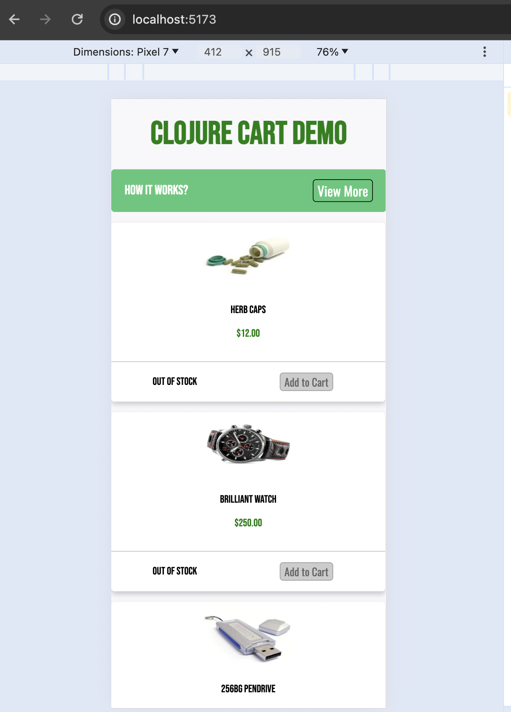
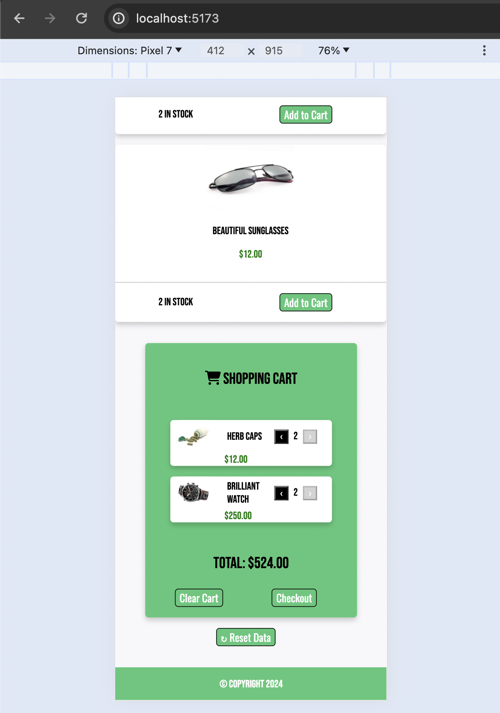

# clj-shopping

This project is based off of the [Redis Shopping Cart app tutorial](https://github.com/redis-developer/basic-redis-shopping-chart-nodejs).

## To Run locally

### Make sure you have

- a local Redis instance running on port 6379
- Java installed
- Clojure installed

#### Start the Server

`clj -T:build all && java -jar target/clj-shopping-standalone.jar`

#### Start the Client in a different terminal window

`cd client`

`npm install`

`npm run dev`

The Swagger API will be at
http://localhost:3000/api/index.html#/


The UI should be running at
http://localhost:5173/





## 

Start a [REPL](#repls) in your editor or terminal of choice.

Start the server with:

```clojure
(go)
```

The default API is available under http://localhost:3000/api

System configuration is available under `resources/system.edn`.

To reload changes:

```clojure
(reset)
```

## REPLs

### Cursive

Configure a [REPL following the Cursive documentation](https://cursive-ide.com/userguide/repl.html). Using the default "Run with IntelliJ project classpath" option will let you select an alias from the ["Clojure deps" aliases selection](https://cursive-ide.com/userguide/deps.html#refreshing-deps-dependencies).

### CIDER

Use the `cider` alias for CIDER nREPL support (run `clj -M:dev:cider`). See the [CIDER docs](https://docs.cider.mx/cider/basics/up_and_running.html) for more help.

Note that this alias runs nREPL during development. To run nREPL in production (typically when the system starts), use the kit-nrepl library through the +nrepl profile as described in [the documentation](https://kit-clj.github.io/docs/profiles.html#profiles).

### Command Line

Run `clj -M:dev:nrepl` or `make repl`.

Note that, just like with [CIDER](#cider), this alias runs nREPL during development. To run nREPL in production (typically when the system starts), use the kit-nrepl library through the +nrepl profile as described in [the documentation](https://kit-clj.github.io/docs/profiles.html#profiles).
